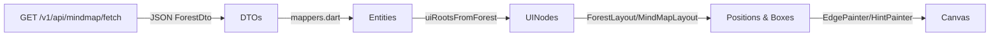

# 🧠 MindMap AI — Demo README

> A Flutter demo that turns free-form text into clean, multi-tree **mind maps**.  
> Built with **MVVM**, animated UI, OpenAI JSON-schema generation, and a minimal REST layer.

---

## ✨ What you’ll see

- Multiple trees (“forest”) laid out top→bottom, left→right
- Per-tree monochrome node colors
- Auto-sizing node cards (width → wrap to next line; center text)
- Elegant connectors:
    - straight top run ➜ vertical trunk ➜ **quadratic elbow** on last child
    - **6 px** spacing between connectors and labels (head and tail)
- Context menu on long-press (Add child / Delete)
- **Hint** affordances:
    - dotted guide only when the focused node has **no** children
    - plus button (outer 28px circle, inner 14px ring, 0.5px #0000000D border, bg #00000008)
- A glowing **AI Prompt Bar** at bottom-left for on-device demo prompts (suffix “cosmo” button animates while generating)
- **Toasts** (success/error) at bottom using `another_flushbar`

---

## 🏗 Project structure (MVVM)

```
lib/
├─ presentation/
│  └─ mind_map/
│     ├─ ui_data/
│     │  └─ node_ui_data_model.dart
│     ├─ widgets/
│     │  ├─ mind_map_page.dart        # screen + InteractiveViewer + prompt bar
│     │  ├─ forest_layout.dart        # lays out multiple roots (forest)
│     │  ├─ mind_map_layout.dart      # lays out a single tree
│     │  ├─ node_widget.dart          # MindNodeCard (tight text, centered)
│     │  ├─ node_context_menu.dart    # Add/Delete popup
│     │  ├─ hint_button.dart          # 28px outer + 14px inner (+) design
│     │  ├─ painters/
│     │  │  ├─ edge_painter.dart      # top straight run + quadratic bottom elbow
│     │  │  └─ hint_painter.dart      # dotted guide only when no children
│     │  ├─ ml_text.dart              # AI Prompt Bar (glowing border/button)
│     │  └─ toast.dart                # Flushbar-based toasts
│     └─ widgets/... (assets, styles)
│
├─ repository/
│  └─ mind_map/
│     ├─ entity/
│     │  ├─ node_dto_model.dart       # DTOs (JSON)
│     │  ├─ node_entity_model.dart    # Domain entities
│     │  └─ mappers.dart              # DTO → Entity → UI mappers
│     ├─ mind_map_repository.dart     # Abstraction + Impl (API + AI)
│     └─ ...
│
├─ services/
│  └─ mind_map/
│     ├─ mind_map_service_interface.dart   # IMindMapService (fetch/save)
│     └─ ml_service/
│        └─ mind_map_ml_service.dart       # IAiPromptService (OpenAI Responses)
│
├─ utility/
│  ├─ constant.dart
│  ├─ styles.dart
│  ├─ node_colors/
│  │  └─ node_color_palette.dart
│  └─ utility.dart                        # OPEN_API_KEY loader
│
└─ view_model/
   └─ mind_map/
      ├─ mind_map_view_model.dart         # Controller (ChangeNotifier)
      └─ ui_event.dart                    # Toast events
```

---

## 🧩 Data model & JSON

### Forest (final shape we use end-to-end)

```json
{
  "mapId": "demo_001",
  "title": "Demo Forest",
  "version": 1,
  "trees": [
    {
      "root": {
        "id": "t1_root",
        "label": "Project Alpha",
        "children": [
          { "id": "t1_c1", "label": "Scope",    "children": [] },
          { "id": "t1_c2", "label": "Timeline", "children": [] },
          { "id": "t1_c3", "label": "Risks",    "children": [] }
        ]
      }
    },
    {
      "root": {
        "id": "t2_root",
        "label": "Marketing",
        "children": [
          { "id": "t2_c1", "label": "Channels", "children": [] },
          { "id": "t2_c2", "label": "Budget",   "children": [] }
        ]
      }
    },
    {
      "root": {
        "id": "t3_root",
        "label": "Personal",
        "children": [
          { "id": "t3_c1", "label": "Health",   "children": [] },
          { "id": "t3_c2", "label": "Learning", "children": [] },
          { "id": "t3_c3", "label": "Travel",   "children": [] },
          {
            "id": "t3_c4",
            "label": "Finance",
            "children": [
              { "id": "t3_c4_1", "label": "Finance - 1", "children": [] },
              { "id": "t3_c4_2", "label": "Finance - 2", "children": [] }
            ]
          }
        ]
      }
    }
  ]
}
```

- `ForestDto` ➜ `ForestEntity` ➜ `UINode` via **mappers**:
    - DTO: JSON from API/AI
    - Entity: domain (immutable)
    - UI: adds palette/colors & is what widgets render

---

## 🔀 How parsing & mapping works



- **Layout rules**
    - First child stays inline with parent
    - Subsequent children stack *below* (no crossing above the first)
    - Connectors:
        - 6px gap at head & tail
        - last child uses **quadratic** curve (`_radius ≈ 8`)
- **Hint painter**
    - Shows dotted guide **only** if focused node has **no** children
    - Otherwise shows only the **+** button

---

## 🤖 AI Prompt Bar (on-device demo)

- The bottom-left input glows with a rainbow border & soft halo
- Suffix circular button animates (cosmos gradient + stars) while generating
- Submit: `Enter` or click the button

**Sample user texts to try:**
- `Create a roadmap for launching a mobile app: planning, design, development, testing, release.`
- `Personal growth plan: health, career, learning, relationships, finance.`
- `Product strategy: market research, positioning, pricing, go-to-market, metrics.`

The prompt engine asks the model to **strictly** emit the forest JSON above (using OpenAI **Responses API** + `text.format: json_schema`).

---

## 🔐 OpenAI integration (Responses API)

We call `POST https://api.openai.com/v1/responses` with:

- `model`: `gpt-4.1-mini`
- `instructions`: “You are a strict JSON generator…”
- `input`: user text
- `text.format`: `{ "type":"json_schema", "name":"ForestDto", "strict": true, "schema": { ... } }`

The parser extracts the JSON from `response.output[0].content[0].text` and converts to your DTO.

> **Env:** add `.env` with `OPEN_API_KEY=sk-...` and load via `flutter_dotenv`.

---

## 🔌 REST API (for demo/server save)

We use **two** endpoints:

### 1) Fetch all saved forests
`GET /v1/api/mindmap/fetch`

**Response:** (ForestDto)
```json
{ "mapId":"demo_001","title":"Demo Forest","version":2,"trees":[ ... ] }
```

### 2) Save forest (full replace)
`POST /v1/api/mindmap/save`

Headers:
```
Authorization: Bearer <token>
Content-Type: application/json
```

Body: **exact** ForestDto (see JSON above)

Response:
```json
{"status":"ok","mapId":"demo_001","version":3}
```

> **Postman Collection:**  
> https://avijitarm1-2013619.postman.co/workspace/Avijit's-Workspace~0993c115-9768-4cac-8247-667540154fb4/collection/47657918-46b40d8d-ac65-4394-93b3-a36606b8c998?action=share&creator=47657918

---

## 🧭 ViewModel (ChangeNotifier) flow

- `load()` → fetch ForestDto → map to UI → `notifyListeners()`
- `generate(prompt)`:
    1. `isGenerating = true` → notify
    2. call `repo.generateForestFromPrompt(prompt)` → OpenAI
    3. map to UI → show success toast
    4. `isGenerating = false` → notify
- `toastEvent` uses `ValueNotifier<UiEvent?>` so the page can show `Flushbar` at bottom.

---

## 🍞 Toasts (bottom, Material-y)

- Package: `another_flushbar`
- Success: lemon-green → white gradient, dark-green text, **outlined** small icon
- Error: pink-red → white gradient, dark-red text, **outlined** small icon
- Single active toast (dismiss previous before showing next)

Usage:
```dart
// In MindMapPage.initState()
widget.vm.toastEvent.addListener(() {
  final e = widget.vm.toastEvent.value;
  if (e != null) {
    Toasts.show(context, type: e.type, title: e.title, message: e.message);
    widget.vm.clearToast();
  }
});
```

---

## ⚙️ Setup & run

1. **Clone**
   ```bash
   git clone <your-repo-url>
   cd mindmap_ai
   ```

2. **Env**
   ```
   OPEN_API_KEY=sk-************************
   ```
   Load it via `flutter_dotenv`.

3. **Dependencies**
   ```bash
   flutter pub get
   ```

4. **Run**
   ```bash
   flutter run
   ```

---

## 📝 Prompts (what we send the LLM)

- **System/instructions**: “You are a strict JSON generator. Only return JSON that validates against the provided schema.”
- **Schema**: ForestDto (mapId, title, version, trees[].root{id,label,children[...]})
- **User input**: the text you type in the prompt bar
- **Guidelines**:
    - Prefer **3–6** trees when scope allows
    - Use **simple, human-readable** labels
    - Keep IDs simple strings (unique per node)

---

## 🎨 UI details worth calling out

- Node cards:
    - tight strut, no extra vertical padding
    - `TextAlign.center`, cursor proportional to font
- Connectors:
    - stroke width from constants
    - **arrowheads are open chevrons** (unfilled)
    - head/tail spacing **6px**
    - bottom elbow uses quadratic (`radius≈8`)
- Hint UI:
    - when node has **children** ➜ show **+ only**
    - when node has **no children** ➜ dotted hint + +
    - plus button: outer 28px circle, inner 14px ring, 0.5px #0000000D, bg #00000008
- AI Prompt Bar:
    - border is a rotating sweep gradient with **blurred halo**
    - suffix button shows “cosmos” gradient + tiny twinkling stars while loading
    - positioned **bottom-left** with safe-area/keyboard offsets

---

## 🧪 Quick sanity check

- Add a 4th/5th child: layout should **not** clip; forest canvas grows rightward
- Long label while editing: node resizes; text stays centered; no cropping
- Focus a node with children: **only** the plus button is shown (no dotted hint)
- Generate via AI: shows loading animation; on success/error → bottom toast
- Zoom button recenters on the focused node

---

## 🧭 Future ideas

- Offline model (on-device LLM) fallback
- Per-node CRUD endpoints (PATCH/POST/DELETE) when needed
- Undo/redo & autosave
- Collapsible subtrees

---

## 📄 License

Demo code for evaluation. Adapt freely for your team/project.

---

If you need the README in a different voice or with inline screenshots, ping me and I’ll tailor it! 🚀
